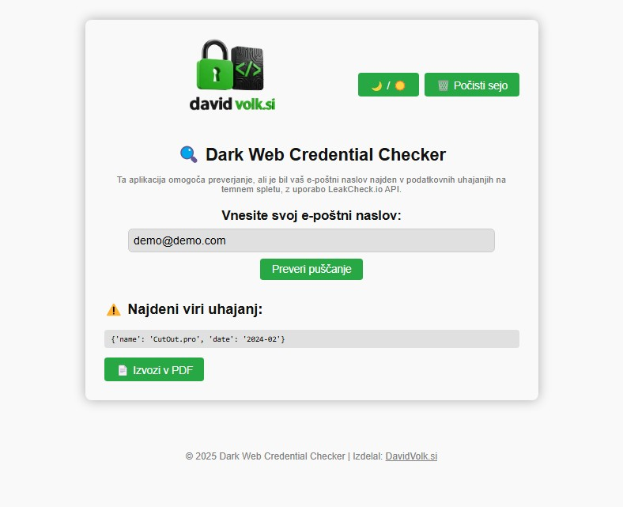

# 🔐 Preverjevalnik e-naslovov na temnem spletu

Preprosta spletna aplikacija na osnovi Flask, ki preveri, ali je vaš e-poštni naslov vključen v znane podatkovne vdore s pomočjo API-ja [LeakCheck.io](https://leakcheck.io/).

---

## 🌐 Funkcionalnosti

- Preklop med svetlo in temno temo
- Vnos e-poštnega naslova z validacijo
- Uporaba LeakCheck.io API za preverjanje uhajanj
- Gumb za ponastavitev seje
- Izvoz rezultatov v PDF
- Odziven in dostopen uporabniški vmesnik

---

## 📦 Zahteve

- Python 3.8+
- Flask
- requests
- jsPDF (naložen prek CDN v HTML)

Namestitev odvisnosti:
```bash
pip install flask requests
```

---

## 🖼️ Predogled


---

## 👨‍💻 Avtor
[DavidVolk.si](https://davidvolk.si)
